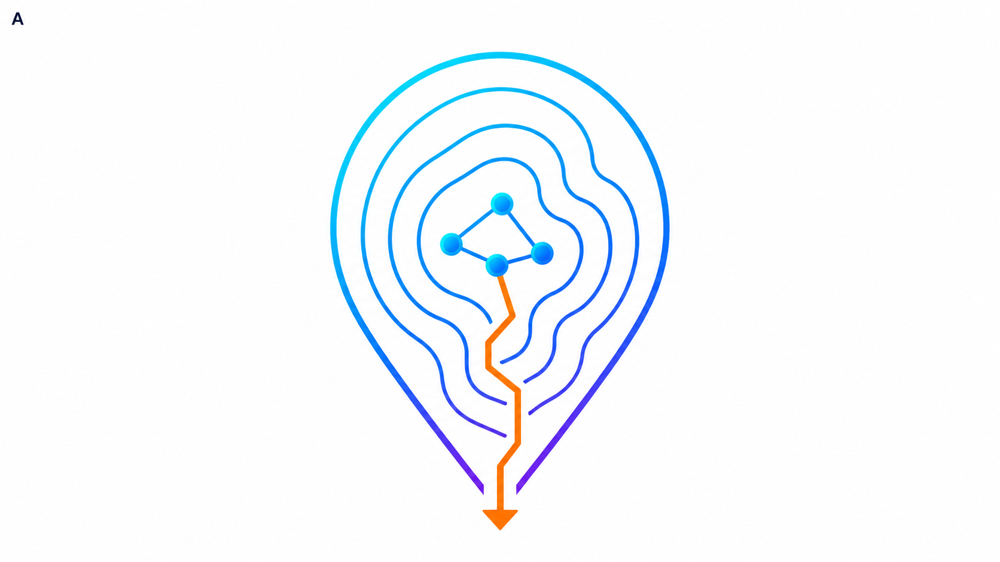

# Landscape Audit

[English](README.md) | [简体中文](README.zh-CN.md)

**Exact neighborhood closure and neutral-plateau certification for discrete local search.**

[](https://github.com/PowellWells/landscape-audit/actions/workflows/ci.yml)
[](https://github.com/PowellWells/landscape-audit/releases)
[](LICENSE)

<p align="center">
  
</p>

Landscape Audit starts from one discrete candidate and deterministically enumerates the neighborhood around it. It distinguishes a state with no improving move from an entire neutral component with no improving exit, checks incremental deltas against an independently recomputed objective, and emits replayable JSON and GraphML artifacts.

It is an **auditor**, not another metaheuristic solver and not a package of global landscape statistics.

```text
x (value 1) --neutral--> y (value 1) --improving--> z (value 0)
```

At `x`, every direct neighbor is no better: `x` is point-local-optimal. But its neutral plateau contains `y`, which has a strict exit to `z`: the plateau is not locally optimal. `lsaudit neutral-trap` finds and certifies exactly this difference.

## v0.1.0 capabilities

- Deterministic strict-descent closure with adapter-defined radius-1 or radius-2 moves.
- Exact neutral-plateau BFS from a supplied state.
- Separate `point_local_optimum` and `plateau_local_optimum` conclusions.
- Honest bounded results: a state limit sets `exact: false` and never certifies plateau closure.
- Atomic checkpoints and continuation with `--resume`.
- Deterministic parallel move evaluation; thread count does not change certificate bytes.
- Per-move incremental/reference consistency checks.
- Replayable JSON certificates with SHA-256 enumeration digests.
- GraphML export for NetworkX, Gephi, or downstream landscape tooling.
- Three unrelated adapters: Max-SAT, graph coloring, and single-machine scheduling.
- A minimal neutral-trap example designed to catch point/plateau confusion.

The hot path is a dependency-free C++20 template library. Adapters own state representation, canonical move generation, application, incremental deltas, and an independent full evaluator.

## Build and run

```bash
cmake -S . -B build -DCMAKE_BUILD_TYPE=Release
cmake --build build --parallel
ctest --test-dir build --output-on-failure

./build/lsaudit neutral-trap \
  --threads 4 \
  --certificate out/neutral-trap.json \
  --graph out/neutral-trap.graphml
```

Expected summary:

```text
objective=1 point_local_optimum=true plateau_local_optimum=false neutral_states=2 exact=true
```

Replay a certificate by recomputing the full enumeration:

```bash
./build/lsaudit neutral-trap --verify out/neutral-trap.json
# VERIFIED: out/neutral-trap.json
```

Run the domain examples:

```bash
./build/lsaudit maxsat --radius 2 --close-first --certificate out/maxsat.json --graph out/maxsat.graphml
./build/lsaudit coloring --radius 1 --threads 4 --certificate out/coloring.json --graph out/coloring.graphml
./build/lsaudit scheduling --radius 2 --close-first --certificate out/scheduling.json --graph out/scheduling.graphml
```

## Bounded audit and resume

Neutral components can be exponentially large. The state limit counts fully expanded plateau states; discovered frontier states are retained in the checkpoint.

```bash
./build/lsaudit neutral-trap \
  --max-states 1 \
  --checkpoint out/trap.checkpoint \
  --certificate out/partial.json \
  --graph out/partial.graphml
# exits with code 3; partial.json has exact=false and termination_reason=state_limit

./build/lsaudit neutral-trap \
  --max-states 100 \
  --checkpoint out/trap.checkpoint \
  --resume \
  --certificate out/complete.json \
  --graph out/complete.graphml
```

## Adapter contract

An adapter is a small statically dispatched type:

```cpp
struct Adapter {
    using State = /* exact state type */;
    using Move = /* canonical move type */;

    std::string instance_id() const;
    std::string neighborhood_id(std::size_t radius) const;
    std::string generator_version() const;
    std::string serialize(const State&) const;
    State deserialize(std::string_view) const;

    std::int64_t full_evaluate(const State&) const;
    std::vector<Move> moves(const State&, std::size_t radius) const;
    std::string move_key(const Move&) const;
    State apply(State, const Move&) const;
    std::int64_t delta(const State&, const Move&) const;
};
```

Radius-2 moves are generated directly by the adapter. The core does not construct them as a Cartesian product of radius-1 moves, avoiding duplicate variables, order-equivalent moves, invalid second moves, and immediate reversals.

`full_evaluate` should be implemented independently of incremental caches. With verification enabled (the default), every predicted value is compared with a full recomputation before it can affect a certificate.

See [examples/adapters.hpp](examples/adapters.hpp) and the [design notes](docs/DESIGN.md).

## Certificate semantics

The JSON artifact is a **replayable computational certificate**, not a formal proof certificate. Its central fields are:

- `exact`: whether the neutral component was exhausted;
- `termination_reason`: `exhausted` or the limiting reason;
- `enumeration_digest`: SHA-256 over canonical, sorted move records;
- `reference_verifier_result`: whether all incremental deltas matched full recomputation;
- `point_local_optimum` and `plateau_local_optimum`: deliberately separate claims.

For a bounded run, `plateau_local_optimum` is always false. The only valid reading is “no improving exit was found within the expanded portion,” never “the plateau is closed.” Details are in [docs/CERTIFICATES.md](docs/CERTIFICATES.md).

## Scope and provenance

Landscape Audit was extracted from the engineering lessons of a reproducible search for Erdős Problem #617, where exhaustive unary/pair scans and neutral-platform audits exposed the difference between a closed state and a closed neutral component. The generic repository does not claim a result on that problem and does not yet ship the high-performance `K26` adapter.

Version 0.1 deliberately does not include a GUI, distributed BFS, GPU backends, arbitrary Pareto orders, automatic arbitrary-k moves, a general symmetry engine, or global ruggedness metrics. See the [roadmap](docs/ROADMAP.md).

## Contributing and citation

Bug reports, small adapters, certificate-replay tests, and bounded-enumeration improvements are welcome. Read [CONTRIBUTING.md](CONTRIBUTING.md). Citation metadata is provided in [CITATION.cff](CITATION.cff).

## License

MIT. See [LICENSE](LICENSE).
